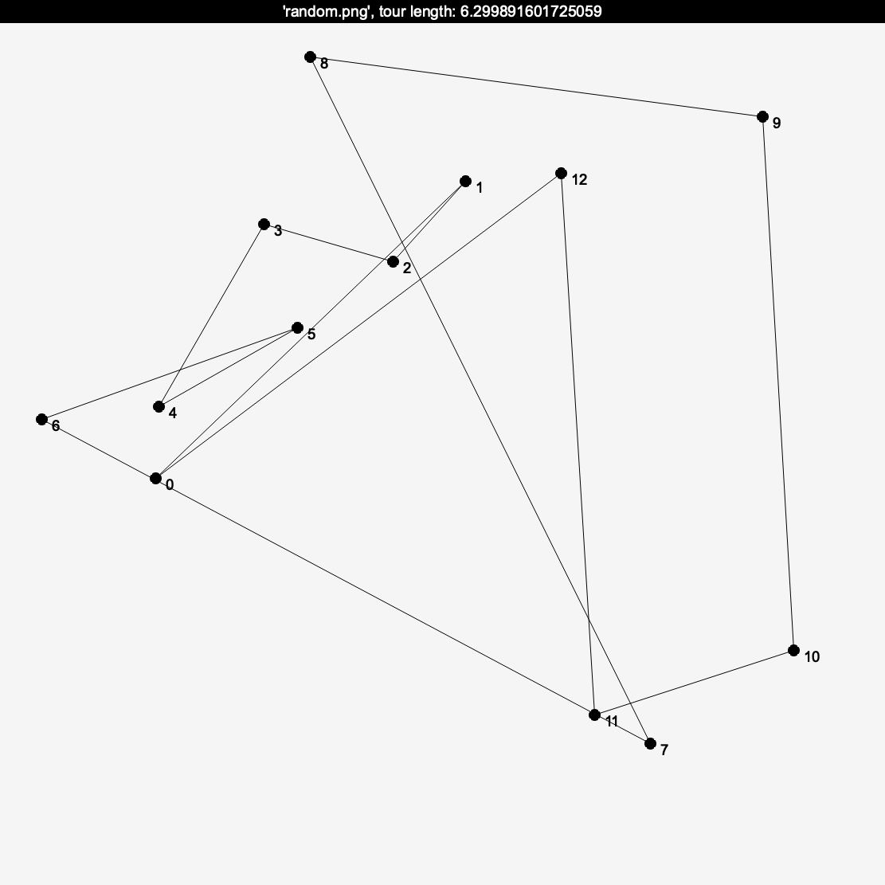
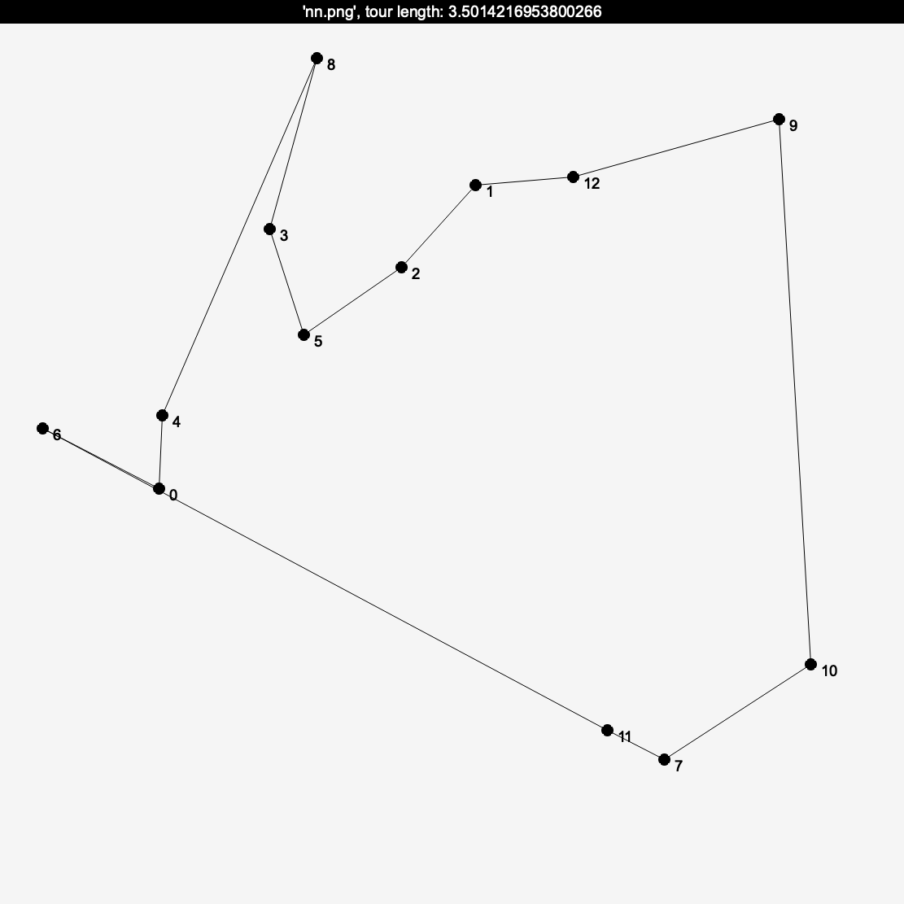
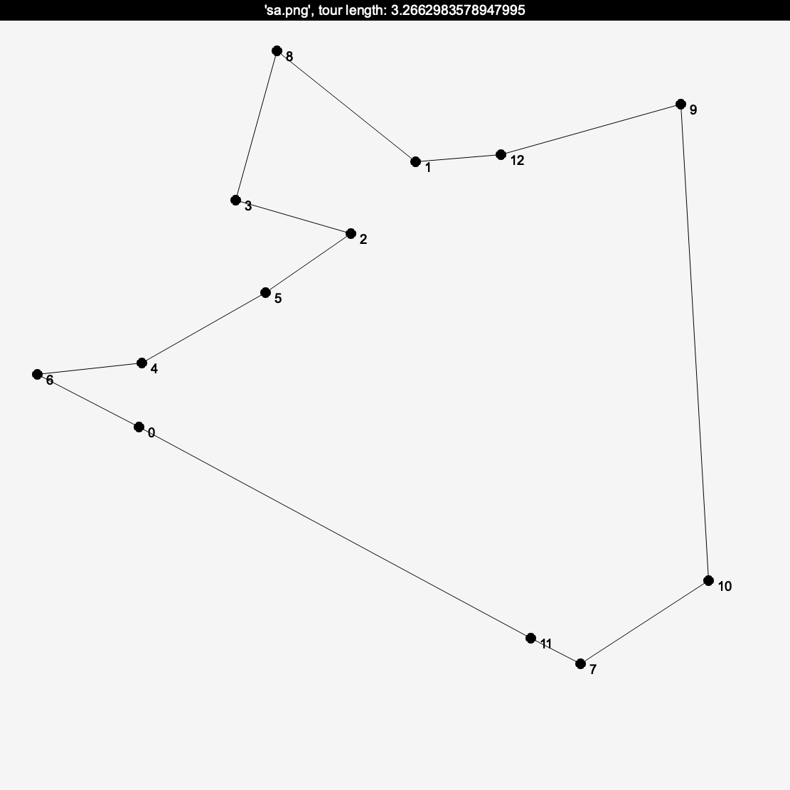

# Travelling Salesman Problem

Exploration of the famous tsp

Rust implementions of the following algorithms:

- brute force
- nearest neighbor
- simulated annealing with random swaps

## Visualization
### Random path

### Nearest Neighbor

### Simulated Annealing

